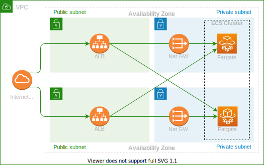

# ECS Infrastructure on AWS

[](https://travis-ci.com/juliocesarscheidt/terraform-ecs-project)
[](https://github.com/juliocesarscheidt/terraform-ecs-project)


> This is a project of Infrastructure as Code to provide an ECS service running on AWS.
> It will deploy fargate instances running ECS services, with auto scaling and service discovery inside a private subnet, with a load balancer in a public subnet to receive traffic from internet.

## Architecture



## Instructions

```bash
# run deploy script
chmod +x deploy.sh && \
  bash deploy.sh
```
